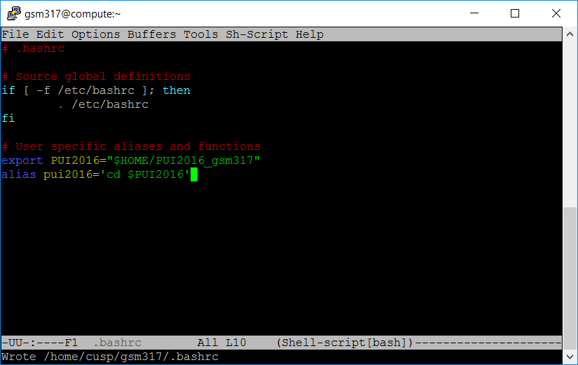

# PUI 2016 HW 1.

## Gregory Mayes, gsm317

*Assignment 1 (G. Mayes)*
Finished Lab 1 to setup a gittest_gsm317 and connect to my github account (gsmayes). Then create myfirstfile.txt, push/pull to github and resolve a merge conflict. Finally, I forked and cloned the github repository 'gittest_cstreich' and sent a pull request. Shay (cstreich) accepted my merge request, but didn't send a pull request in return. I then partnered with xuanzee and accepted her merge request and returned my own.

*Assignment 2 (G. Mayes)*
Set up my environment by creating the directory PUI2016_gsm317 and adding an variable and alias to my profile .bashrc using emacs editor.

.bashrc with variable and alias defined:

sucessfull commands:

*Assignment 3 (G. Mayes)* I was not able to complete the extra credit assignment.

